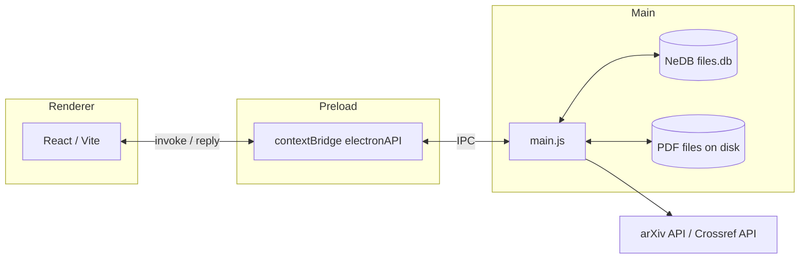

# Architecture

Paper Manager is an **Electron** application with three cooperating layers:

1. **Main process** (`main.js`) — Node.js environment with full OS access. It owns the `BrowserWindow`, native dialogs, filesystem operations, the embedded **NeDB** database file, and outbound HTTP calls to **arXiv** and **Crossref**.
2. **Preload script** (`preload.js`) — runs in an isolated world before the renderer loads. It uses `contextBridge` to expose a small, explicit API on `window.electronAPI` that forwards to `ipcRenderer.invoke`.
3. **Renderer process** — a **React** single-page app bundled with **Vite**. It has **no Node integration**; all privileged work goes through IPC.

## Persistence

- **NeDB** stores `folderData` with **`rootPath`** (opened library directory), **`lastUploadDir`** (target for drag-and-drop uploads), and optional legacy **`folderPath`** (migrated to `rootPath` on startup).
- Per-PDF metadata uses `_id` / `path` matching the **absolute file path** for upserts after metadata fetch or table edits.

## Build outputs

- Vite writes the renderer bundle to **`build/`** (configured in `vite.config.js`).
- `electron-builder` writes installers under **`dist/`** (see `package.json` → `build.directories.output`).
- **`installer/`** is reserved for `buildResources` (installer graphics, custom NSIS snippets, etc.) and must not be confused with the Vite `build/` folder.

## Security posture

- `BrowserWindow` is created with `contextIsolation: true` and `nodeIntegration: false`.
- Only the allow-listed methods on `window.electronAPI` are reachable from React.
